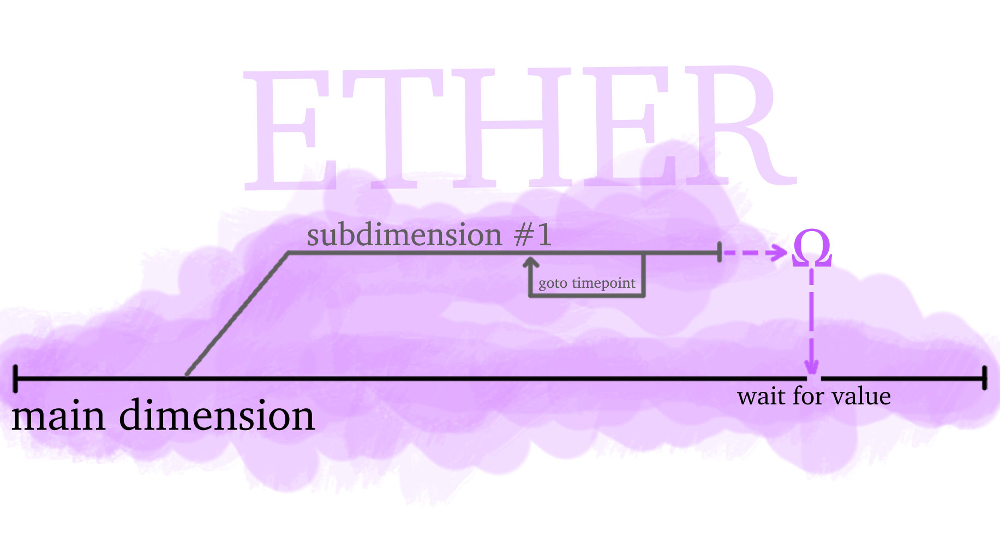

# Ætherlang
Ætherlang is an interpreted constantly-typed functional programming language made with Julia to demonstrate the ether-dimensional programming paradigm. Note that although it is a demonstrational language, it was meant to be usable and engaging. Most libraries with core useful features are still under development, however it is already possible to use Aetherlang. See the website [under construction] for detailed information on the paradigm and tutorials.

## How to install
1. Install Julia (I used Julia v1.6.1 for automatic thread detection and other things, so make sure your version is compatible) and add it to path. No special libraries required.
2. Download and unzip the folder with Aetherlang source code. You can either add it to path or open from your command line interface.
3. There are 2 ways to run a `.aeth` file with code in Aetherlang:
```
julia Interpreter.jl -t auto FILENAME.aeth
```
or
```
./aetherlangrun FILENAME.aeth
```
where `aetherlangrun` is simply a shell script located in the root of the source folder. Make sure you have a compatible terminal and a permission to execute this file.

## Hello, World!
A simple hello world program in current version of Aetherlang would look like this:
```
@ THIS INCLUDES THE TWO NEEDED LIBRARIES
use :base
use :io :io.
@ THIS PRINTS THE TEXT
io.println "Hello, World!"
```
or, like this (Aetherlang is not case-sensitive):
```
USE :IO
GREETING = "Hello, World!"
PRINTLN GREETING
```

## Paradigm Illustrations


## License
Copyright (C) Atell Krasnopolski, 2021
MIT License
